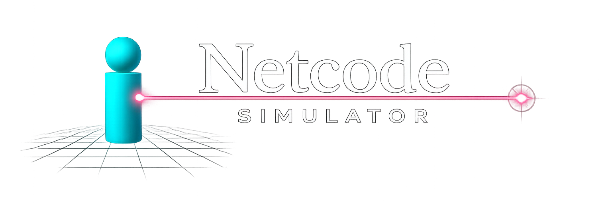

# Netcode Simulator

<p align="center">
  
</p>

<p align="center">
  <a href="https://github.com/tariq10x/netcodesimulator/actions/workflows/ci.yml?query=branch%3Amain"></a>
  <a href="LICENSE"></a>
</p>

Netcode Simulator is a local-first multiplayer netcode sandbox for studying latency, packet loss, prediction, reconciliation, interpolation, lag compensation, replay, and event logging in a small FPS-style client/server environment.

## Prerequisites

- CMake 3.16 or newer
- C++17 compiler
- raylib 6.0

## Build

### macOS

Install dependencies:

```bash
xcode-select --install
brew install cmake raylib
```

Build:

```bash
cmake -S . -B build -DBUILD_TESTING=ON
cmake --build build --target netcodesim --parallel
```

Run:

```bash
./build/netcodesim
```

### Linux (Ubuntu/Debian)

Install dependencies:

```bash
sudo apt-get update
sudo apt-get install -y \
  build-essential \
  cmake \
  libasound2-dev \
  libgl1-mesa-dev \
  libglu1-mesa-dev \
  libx11-dev \
  libxcursor-dev \
  libxi-dev \
  libxinerama-dev \
  libxrandr-dev
```

Build:

```bash
cmake -S . -B build -DBUILD_TESTING=ON
cmake --build build --target netcodesim --parallel
```

Run:

```bash
./build/netcodesim
```

### Windows

Install dependencies:

```powershell
winget install --id Kitware.CMake
winget install --id Microsoft.VisualStudio.2022.BuildTools --override "--wait --quiet --add Microsoft.VisualStudio.Workload.VCTools --includeRecommended"
```

Build:

```powershell
cmake -S . -B build -G "Visual Studio 17 2022" -A x64 -DBUILD_TESTING=ON -DNETCODESIM_USE_SYSTEM_RAYLIB=OFF
cmake --build build --config Release --target netcodesim --parallel
```

Run:

```powershell
.\build\Release\netcodesim.exe
```

## Runtime Flags

Direct join:

```bash
./build/netcodesim --join <host> <port> [player-name]
```

```powershell
.\build\Release\netcodesim.exe --join <host> <port> [player-name]
```

Supported flags:

- `--join <host> <port> [player-name]`: skip the main menu and join a running server.
- `--local-port <port>`: bind the client socket to a specific local UDP port. By default, the OS chooses one.
- `--protocol-version <version>`: override the protocol version sent by the joining client.

## What You Can Do

- Host or join LAN sessions with players and bots.
- Adjust latency, packet loss, tick rate, snapshot rate, and transport behavior.
- Compare prediction, reconciliation, interpolation, server authority, and shot evaluation rules.
- Switch hosted sessions between Diagnostic visualization, which shows ghost tracks, and Reality visualization, which hides diagnostic ghosts from the player view.
- Create character visual presets from the Character Editor menu, then select a hosted-session preset so every player renders with the same shoulder silhouette.
- Record and replay sessions.
- Export gameplay and study event logs.
- Build levels with the level editor.

## Tests

```bash
ctest --test-dir build -C Release --output-on-failure
```

```bash
ctest --preset dev
```

## Quality Checks

```bash
cmake --preset ci
cmake --build --preset ci --parallel
ctest --preset ci

cmake --preset dev-tidy
cmake --build --preset dev-tidy --parallel

cmake --preset dev-sanitize
cmake --build --preset dev-sanitize --parallel
ctest --preset dev-sanitize
```

## Documentation

- `ARCHITECTURE.md`: high-level architecture overview.
- `CONTRIBUTING.md`: setup, test, and pull request expectations.
- `THIRD_PARTY_NOTICES.md`: bundled third-party asset notices.

## Current Limitations

- Local/LAN study use, not internet matchmaking.
- Some recording, replay, and lag-compensation options are not exposed as live in-session toggles.
- Character presets are visual-only in the current phase; authoritative hitboxes still use the baseline character body.

## Citation

Academic use: cite via `CITATION.cff`.

## License

Netcode Simulator is MIT licensed. Bundled Inter font files use the SIL Open Font License 1.1. See `LICENSE` and `THIRD_PARTY_NOTICES.md`.
